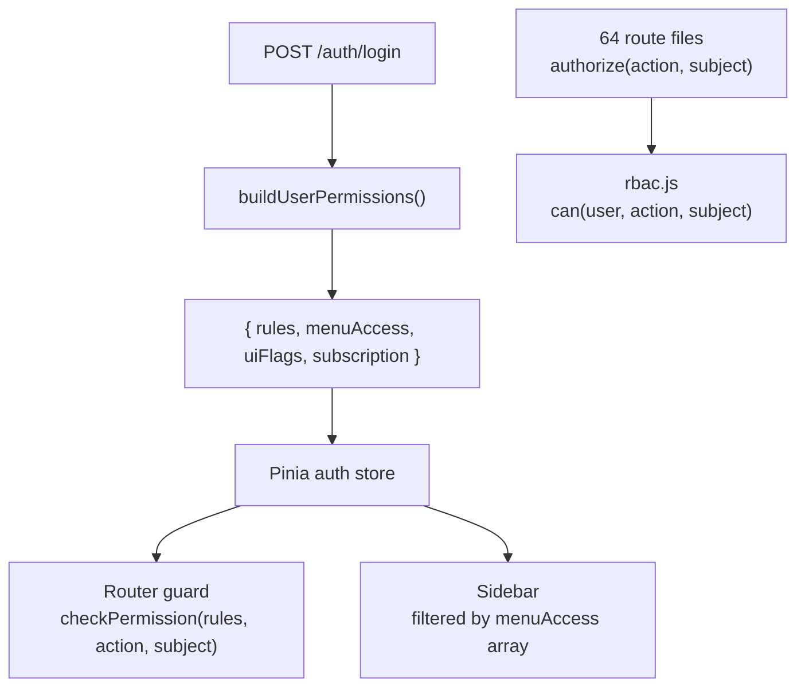

# Custom RBAC Refactor Plan

## Current State (what's wrong)

- `@casl/ability` on backend + frontend — heavyweight, generates 52 subjects + complex rule DSL
- `@casl/vue` installed but **never wired up** — dead dependency
- Frontend manually iterates `caslRules` arrays anyway — not using CASL at all
- Menu visibility (`roleMenuConfig.js`) is **disconnected** from backend `menuConfig.js` — two sources of truth
- Only a handful of route pages actually set `meta.action` / `meta.subject` for route guards

## Target Architecture



## Data Shape (unchanged DB, renamed fields)

```js
// Role.permissions JSON (same DB column, just rename caslRules → rules)
{
  rules: [{ action: 'read', subject: 'Member' }],
  menuAccess: ['dashboard', 'gym', 'finance'],
  uiFlags: { canManageUsers: true, ... }
}
```

No CASL library needed — a `rules.some(r => matches(r, action, subject))` check replaces the entire `@casl/ability` dependency.

---

## Files to Change

### Backend

**New file — [`packages/backend/src/utils/rbac.js`](packages/backend/src/utils/rbac.js)** (replaces `casl.js`)

```js
function can(user, action, subject) {
  if (user?.isSuperAdmin) return true;
  const rules = getEffectiveRules(user); // DB rules || default rules
  return rules.some(r => {
    const actionMatch = r.action === 'manage' || r.action === action;
    const subjectMatch = r.subject === 'all' || r.subject === subject;
    return actionMatch && subjectMatch && !r.inverted;
  });
}
```

**Update — [`packages/backend/src/middlewares/caslMiddleware.js`](packages/backend/src/middlewares/caslMiddleware.js)**
- Rename file to `permissionMiddleware.js`
- Replace `defineAbilitiesFor` + `ability.can()` → `can(req.user, action, subject)` from `rbac.js`
- Export as `authorize(action, subject)` (was `authorizeCasl`)

**Update — [`packages/backend/src/utils/defaultRolePermissions.js`](packages/backend/src/utils/defaultRolePermissions.js)**
- Rename field `caslRules` → `rules` in every role definition
- Keep same structure (action, subject, optional conditions)

**Update — [`packages/backend/src/services/permissionService.js`](packages/backend/src/services/permissionService.js)**
- Rename `caslRules` → `rules` in payload output
- Remove CASL `Ability` build — just return the raw rules array

**Update — 64 route files** (mechanical find-replace)
- `authorizeCasl` → `authorize`
- `require('../middlewares/caslMiddleware')` → `require('../middlewares/permissionMiddleware')`

**Update — [`packages/backend/src/controllers/core/system/permissionController.js`](packages/backend/src/controllers/core/system/permissionController.js)**
- Rename any `caslRules` references → `rules`

**Update — `packages/backend/package.json`**
- Remove `@casl/ability`

---

### Frontend

**New file — [`packages/frontend/src/composables/usePermissions.js`](packages/frontend/src/composables/usePermissions.js)**
- `checkPermission(rules, action, subject)` — same logic as backend `can()`
- `hasMenuAccess(key)` — checks `auth.permissions.menuAccess.includes(key)`

**Update — [`packages/frontend/src/stores/auth.js`](packages/frontend/src/stores/auth.js)**
- Accept `rules` (rename from `caslRules`) in permissions payload

**Update — [`packages/frontend/src/router/index.js`](packages/frontend/src/router/index.js)**
- Replace manual `caslRules` iteration → `checkPermission(rules, action, subject)` from `usePermissions`

**Update — [`packages/frontend/src/composables/core/useNavigation.js`](packages/frontend/src/composables/core/useNavigation.js)**
- Replace `roleMenuConfig.js` lookup → `hasMenuAccess(item.menuKey)` from backend's `menuAccess` array
- This makes backend the **single source of truth** for menu visibility

**Remove — [`packages/frontend/src/navigation/roleMenuConfig.js`](packages/frontend/src/navigation/roleMenuConfig.js)**
- No longer needed; backend `menuAccess` replaces it

**Update — `packages/frontend/package.json`**
- Remove `@casl/ability` and `@casl/vue`

---

---

## Part 2 — Feature Gate Simplification

### Current problems

- `featureGateMiddleware.js` has 4 separate middlewares with **inconsistent trial field names**: `requireModule` reads `isOnTrial`/`trialEndDate` while `requireFeature`/`enforceLimit` read `isTrialActive`/`trialEndsAt` — trial bypass is broken for some routes
- `subscriptionMiddleware.js` is deprecated but still exists alongside the newer gate
- `requireFeature(category, name)` uses a nested category structure (`'transactions', 'vouchers'`) that leaks the DB schema into every route file
- Frontend has **3 overlapping composables** doing nearly the same thing: `useFeatureGate.js`, `useFeatureAccess.js`, `useFeatureMetadata.js`
- `useFeatureAccess.js` has aggressive behaviors (force logout, violation counter, auto-redirect) that are overkill for a single-maintainer app
- `FeatureGuard.vue` has `autoRedirect` + `redirectDelay` props that add complexity without clear benefit

### What changes

**Backend — [`packages/backend/src/middlewares/featureGateMiddleware.js`](packages/backend/src/middlewares/featureGateMiddleware.js)**
- Fix trial field: use one consistent source (`tenant.isOnTrial` + `tenant.trialEndDate`) everywhere
- Simplify `requireFeature(flatKey)` — accept a single flat string key, look it up internally from the registry — callers don't need to know the category
- Remove the old `subscriptionMiddleware.js` file (deprecated)
- Keep `requireModule(name)`, `requireFeature(flatKey)`, `enforceLimit(limitName, getCount)` — 3 clean exports

Example (before vs after):
```js
// Before (leaks category detail into route)
requireFeature('transactions', 'vouchers')

// After (flat, self-describing)
requireFeature('vouchers')
```

**Frontend — collapse 3 composables into 1**

Remove:
- `composables/subscription/useFeatureGate.js`
- `composables/subscription/useFeatureAccess.js`
- `composables/subscription/useFeatureMetadata.js`

Create: **`composables/useSubscription.js`** — thin wrapper over `useSubscriptionStore`:

```js
export function useSubscription() {
  const store = useSubscriptionStore()
  return {
    hasModule: (name) => store.hasModule(name),
    hasFeature: (name) => store.hasFeature(name),   // flat key, no category
    getLimit:   (name) => store.getLimit(name),
    isActive:   computed(() => store.hasSubscription || store.isTrialActive),
  }
}
```

**Frontend — [`packages/frontend/src/components/shared/FeatureGuard.vue`](packages/frontend/src/components/shared/FeatureGuard.vue)**
- Remove `autoRedirect`, `redirectDelay` props
- Remove `useFeatureAccess().guardFeature()` call on mount
- Keep: slot-based show/hide + optional upgrade prompt

**Frontend — `useSubscriptionStore` in [`packages/frontend/src/stores/subscription.js`](packages/frontend/src/stores/subscription.js)**
- Flatten `hasFeature(category, name)` → `hasFeature(flatKey)` — internally searches all categories
- Fix trial field to match backend (consistent field name)

**Frontend — `v-feature-lock` directive** — simplify binding to use flat key:
```html
<!-- Before -->
<div v-feature-lock:module="'restaurant'">
<div v-feature-lock:feature="{ category: 'transactions', name: 'vouchers' }">

<!-- After -->
<div v-feature-lock:module="'restaurant'">
<div v-feature-lock:feature="'vouchers'">
```

**Remove `useSubscriptionMonitor.js`** aggressive behaviors:
- Keep the periodic re-fetch (every 24h is fine)
- Remove forced logout on subscription loss — just show the modal and block UI; a single-maintainer app doesn't need silent session termination

---

## Migration Notes

- **DB is untouched** — existing `Role.permissions` JSON with `caslRules` key will be migrated via a one-time script renaming the field to `rules`; `SubscriptionPlan.features` shape is untouched (only the lookup API changes)
- **No breaking changes to REST API** — payload field rename `caslRules` → `rules` requires frontend + backend to land together in one deploy
- **Conditions** (`tenantId: '$tenantId'`) are not enforced in middleware today anyway — we keep them in the rule shape but don't evaluate them in route guards (same behavior)
- **SuperAdmin path unchanged** — `isSuperAdmin` is always the first short-circuit in both `can()` and all feature gate middlewares
- **Trial fix** — standardize on `tenant.isOnTrial` + `tenant.trialEndDate` across all gate middlewares
